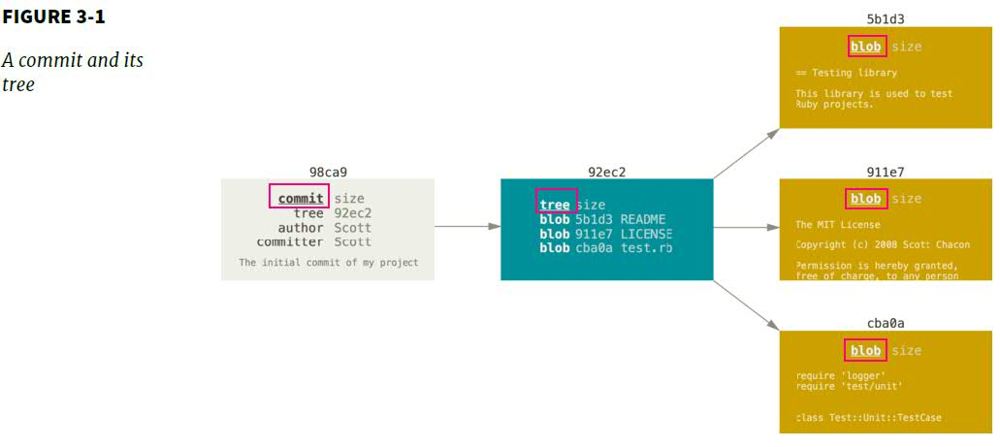
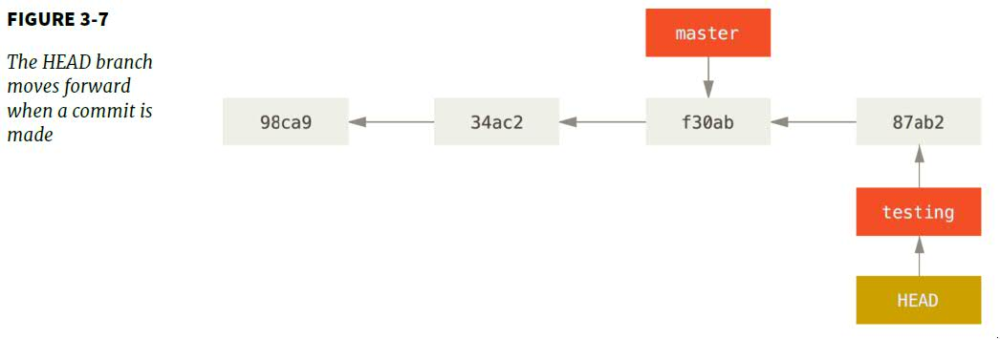
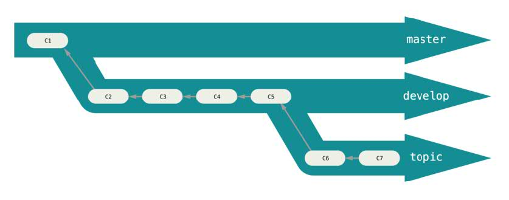
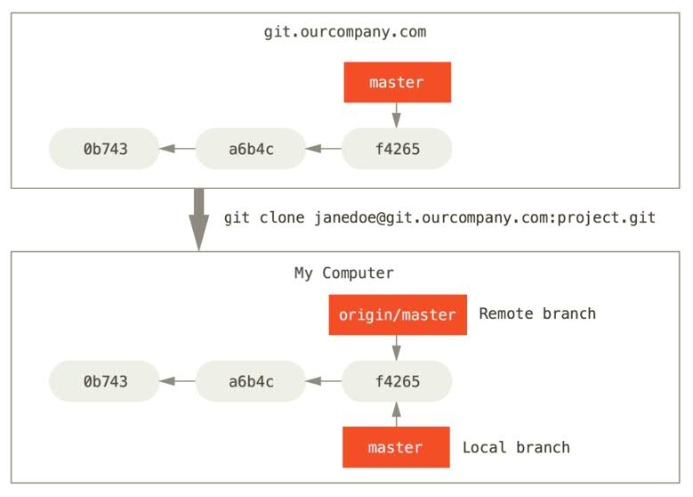

### Branches in a Nutshell

> Some people refer to Git's branching model as its "killer feature". 
A branch in Git is simply a lightweight movable pointer to commits

- A branch represents an independent line of development. 
- A way to request a brand new working directory, staging area, and project history.
- New commits are recorded in the history for the current branch, which results in a fork in the history of the project.

### A Commit and its Tree

When you create a commit by `git commit`:
- Git checksum each subdirectory
- Stores those tree objects
- Creates a commit object that has metadata and a pointer to the tree

### How does Git know that what branch you're currently on?
> It keeps a special pointer called `HEAD` to the local branch. The `HEAD` branch moves forward when a commit is made.

### Branching Workflows

- Long-Running Branches
  > It has several branches that are always open and that you use for different stages of your development cycle. Your branches are at various level of stability.
  - Have only code that is entirely stable in `master` branch
  - Have another parallel branch named `develop` or `next`
  - Have many `topic` branches
  

  
- Topic Branches
  > A short-lived branch that you create and use for a single particular feature or related work.

- Remote Branches
  > Remote references are references in your remote repository, includuing branches, tags, and so on.
  

  
- Tracking branches
> Tracking branches are local branches that have a direct relationship to a remote branch. 

- The Perils of Rebasing
> Do not rebase commits that exist outside your repository
  - Duplicate commit logs can confuse people
  - Reintroduce all those rebased commits back to central server.
  - Commit log is a record of what actually happened or the story of how your project was made.
  
### Forked Public Project

- You don't have the permissions to directly update branches.
- Clone/Fork the main repository
- Add the forked repository as a second remote
- 
